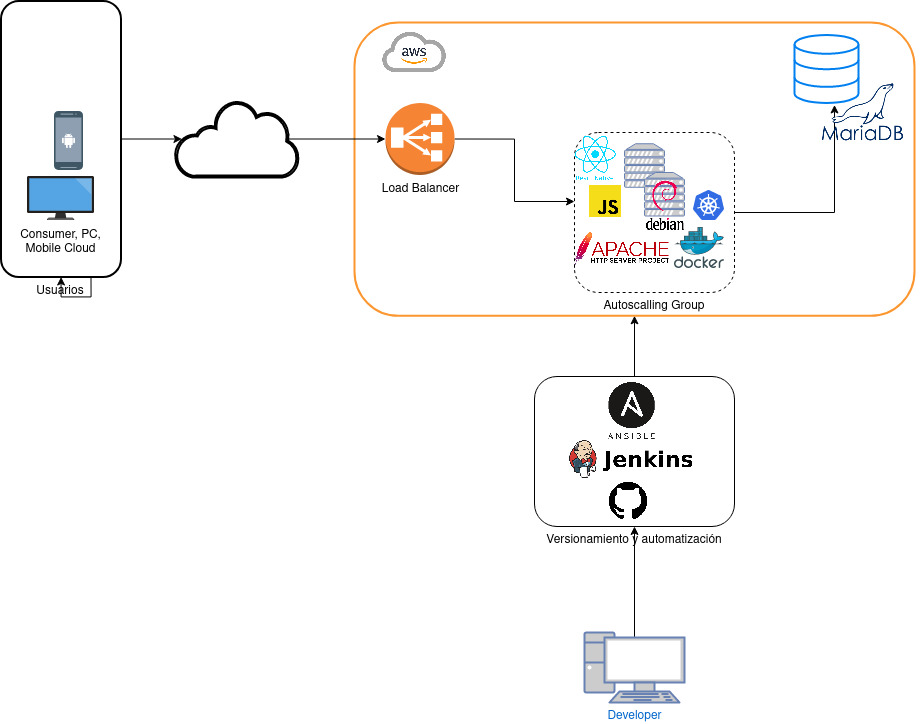
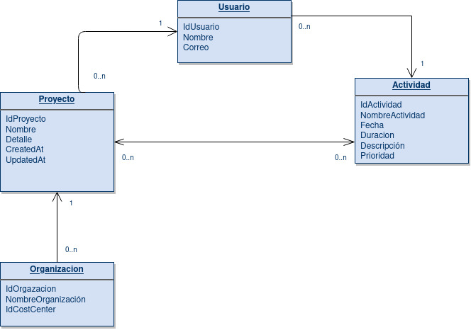

# Agend 
Organiza de la mejor manera tu tiempo

Table of Contents
=======================

* [Quienes somos](#quienes-somos)
* [Arquitectura](#arquitectura)
* [Mockups](#mockups)
* [Base de Datos](#bases-de-datos)
* [Historias de Usuario](#historias-de-usuario)

---

Quienes somos
-------

> The overriding design goal for Markdown's
> formatting syntax is to make it as readable
> as possible. The idea is that a
> Markdown-formatted document should be
> publishable as-is, as plain text, without
> looking like it's been marked up with tags
> or formatting instructions.

This text you see here is *actually* written in Markdown! To get a feel for Markdown's syntax, type some text into the left window and watch the results in the right.

Mockups
-------
Aquí pondríamos una vista de los mockups

Arquitectura
-------
Imagen sobre la arquitectura usada

Base de Datos
-------
Nuestra database

Historias de usuario
-------

### Tech

Dillinger uses a number of open source projects to work properly:

* [AngularJS] - HTML enhanced for web apps!
* [Ace Editor] - awesome web-based text editor
* [markdown-it] - Markdown parser done right. Fast and easy to extend.
* [Twitter Bootstrap] - great UI boilerplate for modern web apps
* [node.js] - evented I/O for the backend
* [Express] - fast node.js network app framework [@tjholowaychuk]
* [Gulp] - the streaming build system
* [Breakdance](https://breakdance.github.io/breakdance/) - HTML to Markdown converter
* [jQuery] - duh

And of course Dillinger itself is open source with a [public repository][dill]
 on GitHub.

Desarrollo
--------

¿Quiéres contribuir?
Tus aportes son bienvenidos en:
    eduardo.carrion@epn.edu.ec

License
----

GNU GPL v2

**Free Software, Hell Yeah!**

   [dill]: <https://github.com/joemccann/dillinger>
   [git-repo-url]: <https://github.com/joemccann/dillinger.git>
   [john gruber]: <http://daringfireball.net>
   [df1]: <http://daringfireball.net/projects/markdown/>
   [markdown-it]: <https://github.com/markdown-it/markdown-it>
   [Ace Editor]: <http://ace.ajax.org>
   [node.js]: <http://nodejs.org>
   [Twitter Bootstrap]: <http://twitter.github.com/bootstrap/>
   [jQuery]: <http://jquery.com>
   [@tjholowaychuk]: <http://twitter.com/tjholowaychuk>
   [express]: <http://expressjs.com>
   [AngularJS]: <http://angularjs.org>
   [Gulp]: <http://gulpjs.com>
