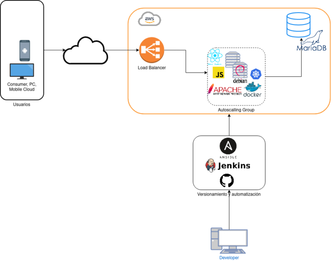
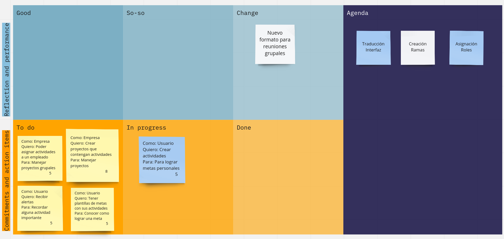

# Agend 

Agend es una aplicación sencilla que busca ofrecerte una herramienta para gestionar tus actividades y así logres tus metas. Organiza tu tiempo y consigue tus metas no solo individuales sino también grupales.

[]

Table of Contents
=======================

* [Quienes somos](#quienes-somos)
* [Arquitectura](#arquitectura)
* [Mockups](#mockups)
* [Database](#database)
* [Historias de Usuario](#historias-de-usuario)
* [Desarrollo](#desarrollo)
* [Licencia](#licencia)

---

Quienes somos
-------

Buscamos ofrecer una app que te permita manejar tu tiempo de manera que puedas conseguir tus metas. Puedes ir más y tener metas grupales te ayudamos a que en equipo puedas lograr tus metas.

Por nuestro diseño las empresas pueden aprovechar nuestra app para el manejo de sus proyectos.

> “El talento gana partidos, pero el trabajo en equipo y la inteligencia ganan campeonatos.” (Michael Jordan)

> “Ninguno de nosotros es tan listo como todos nosotros. ” (Ken Blanchard)

Mockups
-------

[Hecha un vistaso a la aplicación](https://www.figma.com/file/YBSq1VzG63potczpzNlXMS/Untitled?node-id=0%3A1)

Arquitectura
-------
La arquitectura sobre la que se soporta el proyecto

Database
-------
Nuestro diseño Entidad-Relación para la base de datos es el siguiente:

Historias de usuario
-------
Avance del proyecto

Desarrollo
--------

¿Quiéres contribuir?

Tus aportes son bienvenidos en:

    eduardo.carrion@epn.edu.ec

Licencia
----

GNU GPL v2
